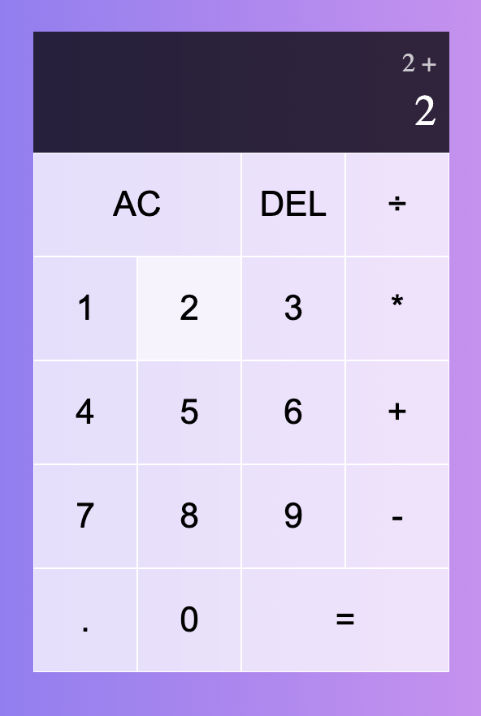
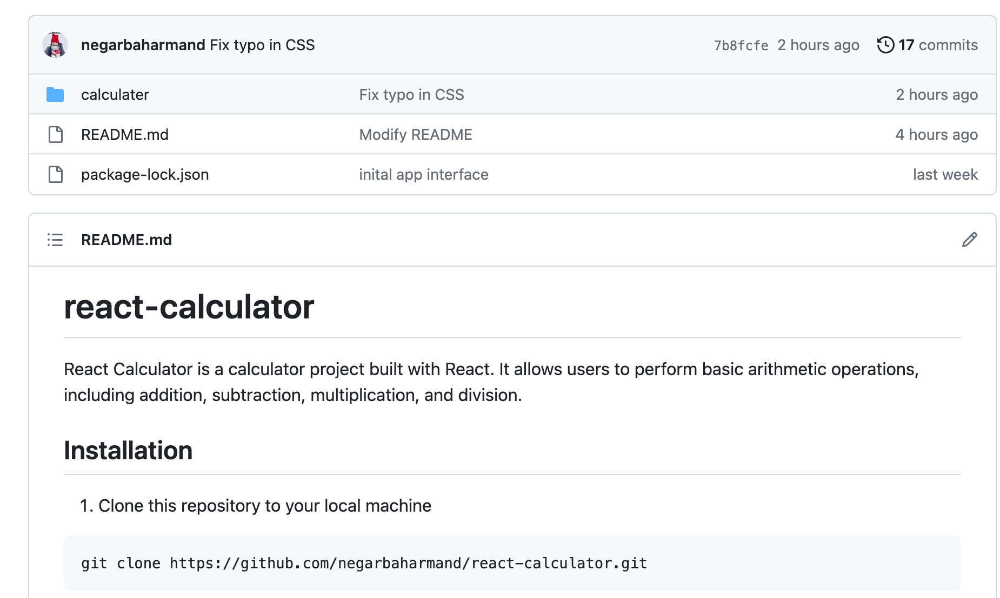

This project is a calculator React app. I used the CSS Grid to lay out the whole calculator. The output box contains two sections, including current-operand (where we are in the act of typing) and previous-operand(the last number and the operation sign).


Take a moment to check out this React calculator app on GitHub pages. I invite you to give it a try and experience its functionality firsthand:
[Calculator](https://negarbaharmand.github.io/react-calculator/)

To add functionality to my calculator, I didn’t rely on any math library, and I used the useReducer hook to manage all the states. Our state has different variables, including currentOperand, previousOperand, and operation.
The hard part about this project was writing the reducer function for managing all the states. Here I broke action into type and payload because we have different actions and types of those actions that also pass along various parameters (different digits and operations). In fact, ACTIONS is an array containing our types.

```javascript
const ACTIONS = {
  ADD_DIGIT: "add-digit",
  CHOOSE_OPERATION: "choose-operation",
  CLEAR: "clear",
  DELETE_DIGIT: "delete-digit",
  EVALUATE: "evaluate",
};
```

I created two components to make the buttons: DigitButton and OperationButton, so I could call my reducer function for the onClick event.
Suppose you are interested in checking out all the logic and conditions behind the operations and trying out the calculator. In that case, feel free to find the code on GitHub from the link below and follow the instructions in the README file to get started.
[Calculator React App](https://github.com/negarbaharmand/react-calculator.git)


