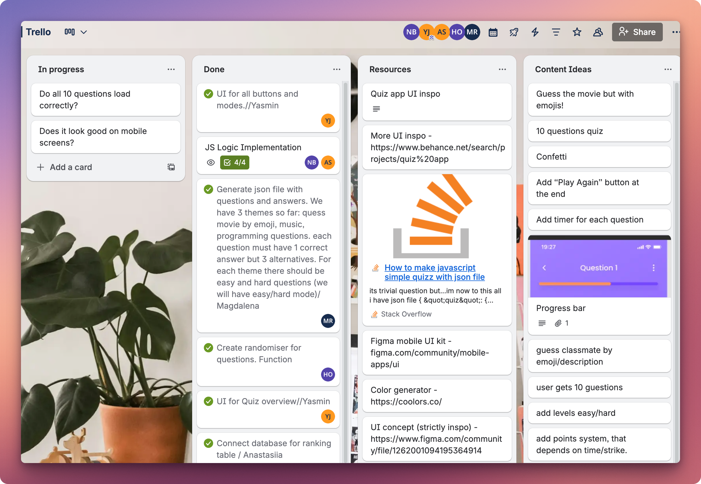
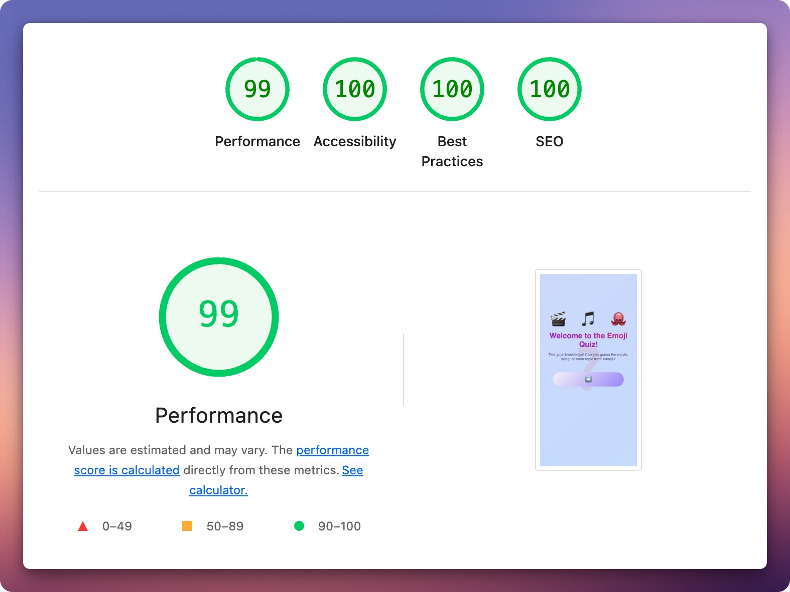
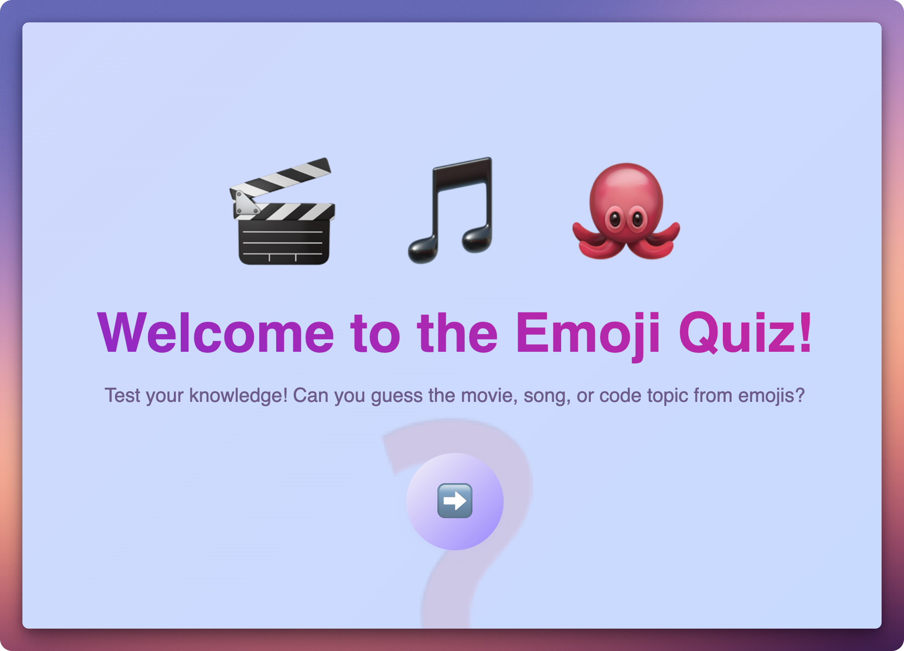

When we set out to build Guessy Messy, a quiz app with emoji-based questions, I thought the challenge would be the technical implementation. Turns out, coordinating five developers was far more complex than any JavaScript logic.
The app itself is straightforward—users answer quiz questions, race against a timer, and compete on a leaderboard. But what started as a simple concept became an excercise in team coordination, professional development practices, and building production-ready applications.

## The Real Challenge Wasn't the Code

Five people working on the same codebase could easily descend into chaos. We needed structure from day one. We set up a Trello board with clear task ownership—each card had a specific person assigned, acceptance criteria, and dependencies marked. This wasn't bureaucracy; it was survival.

Our Trello workflow: from planning to deployment
For version control, we adopted a feature branch workflow. No one pushed directly to main. Every change went through a pull request with at least one review. This caught bugs early and, more importantly, kept everyone informed about what was happening acros the codebase.
The daily five-minute check-ins on Discord became essential. What are you working on? Any blockers? Simple questions that prevented duplicate work and kept us aligned. Looking back, we probably spent 10% of our time on coordination and saved 50% of our time avoiding conflicts and confusion.

## Treating "Simple" Like "Professional"

Yes, our quiz app is technically straightforward vanilla JavaScript, some CSS, a PostgreSQL database through Supabase. But simple doesn't mean amateur. We made a deliberate choice to treat this like a production application.
We implemented comprehensive SEO optimization: proper meta tags, semantic HTML structure, robots.txt for search engines, and W3C validation with zero errors. We optimized performance with lazy loading, efficient script loading, and responsive design across three breakpoints.

Best Practices, and SEO
We integrated Google Analytics to track user behavior, which quiz types are most popular, completion rates, engagement metrics. These weren't just checkboxes to tick; they transformed our project from a code exercise into something we could confidently show employers.

## What Actually Mattered

The technical problems were solvable. Need to implement a timer? There's documentation for that. Struggling with CSS layouts? Stack Overflow has answers. But coordinating five people's schedules, resolving disagreements about features, maintaining motivation through setbacks, those required skills no tutorial teaches.
Our biggest merge conflict happened when three people edited the same CSS file simultaneously. The solution wasn't better Git commands; it was better communication. A simple "I'm working on the quiz screen styles" message in our team chat prevented future conflicts. We reorganized our CSS into separate files—base styles, components, quiz-specific, responsive—making it clearer who should edit what.
We learned to make smaller, more frequent commits. Instead of masive changes that were painful to review and merge, we pushed focused updates. This made code reviews faster and made it easier to track down bugs when they appeared.

## The Stack and Why It Works

We built with vanilla JavaScript, HTML5, and CSS3, no frameworks. This constraint forced us to understand fundamentals: DOM manipulation, event handling, state management. We used Supabase for our PostgreSQL database, which gave us a production-ready backend without writing server code. Netlify handled deployment with automatic builds from our main branch.
This stack is simple but modern. ES6 modules, CSS custom properties, semantic HTML. It shows we understand fundamentals while using current best practices. And it's something we can actually explain in interviews without hand-waving about framework magic.

## The Results

We shipped a fully functional quiz app with three categories, six quiz types, and 60 questions. Users can compete on a leaderboard, use hints strategically, and play on any device from phone to desktop. The app loads in under a second, works on slow connections, and has zero console errors.

The live app: emoji-based questions with timer and progress tracking

But more valuable than the app itself was learning how to coordinate a team, manage a project with proper tools, and ship production-ready code. We made mistakes, waiting too long to deploy, making commits that were too large, not planning thoroughly enough at the start. But we learned from each one and adjusted our process.

## What I'd Tell My Past Self

Spend more time planning upfront. We jumped into coding too quickly and spent days refactoring what better planning would have prevented. Deploy early and often, we waited until near the end and missed catching production-only bugs sooner. Write smaller commits with clear messages, your teammates will thank you during code review.
Most importantly: the human challenges are harder than the technical ones. Good communication, clear documentation, and organized workflows aren't nice-to-haves. They're what make team development possible.
The code is just the beginning. The collaboration, organization, and professionalism—that's what makes a project worth showing.

Try it: [https://guessymessy.netlify.app/](https://guessymessy.netlify.app/)

Source: [https://github.com/negarbaharmand/guessymessy](https://github.com/negarbaharmand/guessymessy)
