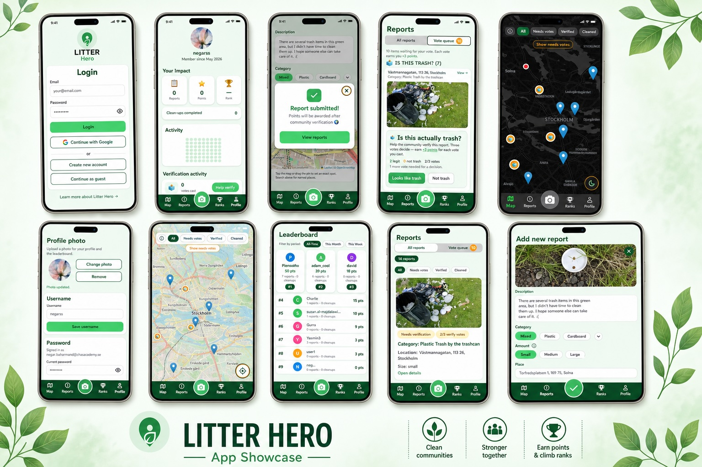
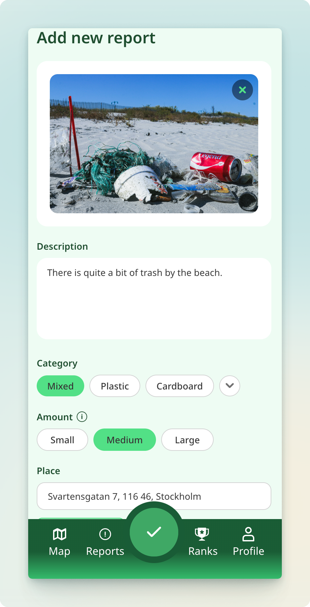

When I moved to Sweden, one of the first things that surprised me was how clean the streets were, not because of a cleaning crew working overnight like back home, but because people just did it themselves. That sense of responsibility genuinely impressed me, I never really seen that before.
So when the idea of building something for the community came up I immediately thought: what if we could use tech to motivate even more people to do that? Something like Pokémon GO, but for picking up trash.
That's how Litter Hero was born.

## TABLE OF CONTENTS

## What Is Litter Hero?

Litter Hero is a community-driven civic gamification web app where you can report litter,
pin it on a map, and earn points when your cleanup gets verified by other users. It's inspired by [Håll Sverige Rent](https://hsr.se/) — Sweden's
non-profit that mobilized over **840 000 people** in a single year to clean up their surroundings, but with a gamified twist to keep people actually coming back.

The flow is pretty straightforward:

- See trash → snap a photo → drop a pin on the map → submit
- Clean it up → submit proof → community votes to verify
- Get points → climb the leaderboard → feel good about it

## The Stack

We went with a modern, production-style setup:

| Layer    | Tech                                  |
| -------- | ------------------------------------- |
| Frontend | React, TypeScript, Vite, Tailwind CSS |
| Backend  | Node.js, Express, TypeScript          |
| Database | PostgreSQL + PostGIS, Drizzle ORM     |
| Auth     | JWT + Google OAuth                    |
| Storage  | Garage S3                             |
| API Docs | Swagger / OpenAPI                     |
| DevOps   | GitLab CI/CD, Kubernetes              |

We also had proper engineering practices, merge requests had to be
reviewed before merging, pipelines had to pass, and we deployed on
Kubernetes.

## How It Works

### Reporting Litter

You open the app, take a photo, categorize the litter by type and size,
and your GPS location gets tagged automatically. One submission and it's
live on the map for everyone to see.

_Litter reporting form with automatic location tagging_

### Community Verification

This is the part I'm most proud of conceptually. When someone claims
they've cleaned up a spot, they submit photo evidence, and other users
vote on whether it's legit. The community becomes the moderator.
No fake cleanups, no easy point farming.

_Community voting interface for cleanup verification_

### Points, Badges & Leaderboard

Points are awarded based on litter size and verified cleanups. You also
unlock badges for milestones like your first report, first cleanup, and
first verification vote — and there's a streak system to keep you
coming back. Turns out a little friendly competition goes a long way,
even when the prize is just a digital badge for now.

_Left: your impact stats and activity — Right: badges, streak and next milestone_

_The all-time leaderboard_

## The Hardest Part

The voting system was genuinely tricky. How do you verify a cleanup is
real without a human moderator reviewing every single submission? We
solved it with peer verification — but it's not bulletproof. There's
still ways to game it, and I kept thinking _there should be a better way_.

The answer I think, is AI. Image recognition that compares before/after
photos and flags suspicious submissions automatically. That's probably
the first thing I'd build if we kept going with this.

## The Moment Everything Clicked

There's a specific kind of joy when you've been working on frontend and
backend in parallel for weeks and you finally connect them. APIs respond.
Images upload to Garage S3. Data flows end to end. When that happened on
Litter Hero I genuinely did a little victory dance at my desk, no shame.

_The map view — every pin is a real report from a real user_

## The Team

This wasn't a solo project. We were a team of five developers, three
UI/UX designers and a DevOps engineer. I worked fullstack, which meant
jumping between React components and Express routes throughout the day.
It also meant I got to see how every piece connected, which I really loved.

## What I'd Add Next

If I could keep building this:

- **AI-powered verification** — let a model analyze before/after photos
  instead of relying only on community votes
- **Real rewards** — actual gifts or offers not just badges (badges are cool but
  a free coffee or 10 percent discount on a gym pass hits different)
- **A more polished UX** — especially on mobile, there are some flows
  that could be way smoother

## See the Code

The code is open and I'd love for you to take a look:

👉 [GitHub — Litter Hero](https://github.com/negarbaharmand/Litter-Hero)

If you're curious about the voting logic, the Garage S3 integration or
how we structured the CI/CD pipeline, feel free to open an issue or
just reach out. I'd genuinely love to talk about it.

---

_Built with React, Node.js, PostgreSQL, and the quiet hope that fewer
people leave their trash on Stockholm's streets._
