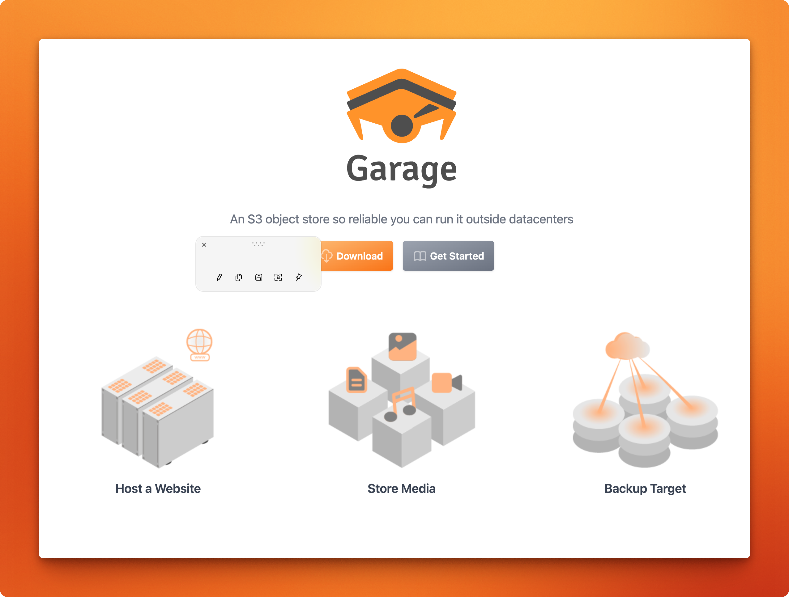

When we started building **Litter Hero**, a reporting app where people photograph litter and log cleanup spots, the question of _where do the photos actually live_ came up pretty fast. Stuffing image blobs into Postgres felt wrong. Not just "wrong" in a code-smell way, but wrong in a _your database will hate you in three months_ way. So we needed object storage.

Here's the thing though: we didn't set up a single storage node. The challenge's DevOps team ran Garage on the shared Kubernetes cluster and handed us credentials over Slack. We got a bucket name, an access key, a secret, and a hostname. That was it. Our job was to wire it into the Express backend, and that turned out to be a surprisingly interesting little engineering problem — honestly more than I expected from "here's a bucket and three env vars."



## TABLE OF CONTENTS

## What even is Garage?

[Garage](https://garagehq.deuxfleurs.fr) is a lightweight, distributed, open-source object store built by [Deuxfleurs](https://github.com/deuxfleurs-org/garage). It's written in Rust, ships as a single binary, and — most importantly for us — **speaks the S3 API**. That last part is the whole point. Your app never talks to "Garage" by name in code; it talks S3. Which means you use the standard `@aws-sdk/client-s3`, the same tooling you'd use with actual AWS, and Garage just sits there pretending to be Amazon.

Compared to MinIO (heavier, more features, ~500 MB RAM) or real AWS S3 (managed but pay-per-byte), Garage is the quiet one in the corner: ~50 MB RAM, no bucket policies, no versioning — but it handles `PutObject` and public URLs just fine, which is all we needed.

## Why not just store images in Postgres?

Short answer: because Postgres is great at rows, not megabytes.

The pattern we went with is the standard one: **Postgres holds metadata** (`image_url` as a `varchar(500)`), and the **bucket holds the actual bytes**. The report row in the DB is tiny. The image lives at a public URL. `ReportList` renders `` and the browser fetches it directly from Garage's endpoint — no backend involved at display time.

This also makes future CDN integration trivial: swap the URL prefix, done.

## The upload pipeline

The flow is a two-step process, and keeping those steps separate was a deliberate design choice:

```
User picks/captures image
        ↓
POST /api/upload  (multipart + JWT)
        ↓
Multer buffers file in memory
        ↓
uploadImageToGarage → PutObject → returns public URL
        ↓
Frontend calls POST /api/reports with { imageUrl, location, ... }
        ↓
Postgres stores the URL string
```

Step one gives you a URL. Step two uses that URL. The report can even be created _without_ an image — `imageUrl` is optional, so `uploadReportImage` only fires if a file was actually selected.

The multer config is intentionally minimal. Memory storage, 10 MB cap, images only:

```ts
// Store uploaded files in memory — the buffer is forwarded directly to Garage
const upload = multer({
  storage: multer.memoryStorage(),
  limits: { fileSize: 10 * 1024 * 1024 }, // 10 MB max
```

No temp files on disk. The buffer goes straight to the Garage service. Pretty straightforward once you see it.

## The Garage service itself

The core of the integration lives in `backend/src/services/garage.ts`. The S3 client setup looks like this:

```ts
return new S3Client({
  endpoint,
  region,
  credentials: { accessKeyId, secretAccessKey },
  // Required for path-style URLs that Garage uses (e.g. https://garage.example.com/bucket/key)
  forcePathStyle: true,
});
```

And the upload + URL construction:

```ts
const ext = path.extname(originalName) || ".jpg";
const objectKey = `reports/${randomUUID()}${ext}`;

const client = getGarageClient();

await client.send(
  new PutObjectCommand({
    Bucket: bucket,
    Key: objectKey,
    Body: fileBuffer,
    ContentType: mimeType,
  })
);

// Garage serves objects at: <endpoint>/<bucket>/<key>
return `${endpoint}/${bucket}/${objectKey}`;
```

Clean, single-responsibility, nothing fancy. UUID key means no collisions. Public URL is built manually after upload because `PutObject` doesn't return one.

## The gotchas (a.k.a. the fun part)

**`forcePathStyle: true` is not optional.** By default, the AWS SDK constructs virtual-hosted-style URLs: `https://bucket-name.your-endpoint.com/key`. Garage doesn't do DNS-level bucket routing like that — it expects path-style: `https://your-endpoint.com/bucket-name/key`. Without `forcePathStyle: true`, every upload silently targets the wrong host. I spent an embarassing amount of time staring at 404s before finding that one flag.

**The region is fake, and that's fine.** The AWS SDK requires a region string. Garage doesn't care what it says. We set `S3_REGION=garage` in `.env` and moved on. It works, weirdly enough.

**The URL you store must match how objects are actually served.** We build `${endpoint}/${bucket}/${objectKey}` manually after upload. If your endpoint or bucket name changes, old URLs in the DB break. So get this right early and keep it consistent.

**Camera path needs the same pipeline.** The camera component captures a JPEG as a canvas data URL, decodes it to a `Blob`, wraps it in a `File`, and hands it to the parent. From there it hits the exact same `uploadReportImage` function as a gallery pick. One upload path, two input sources.

## Security: the backend as gatekeeper

The browser never sees S3 credentials. Ever. The upload route requires a valid JWT (`authenticate` middleware), so only logged-in users can trigger a `PutObject`. Keys live in backend `.env` during development and in Kubernetes sealed secrets in production — never in the React app, never in `git`. The DB stores a URL string, not a secret.

```
Browser → POST /api/upload (Bearer token) → Express → Garage
                                               ↑
                                          S3 keys live here only
```

## Takeaway

The interesting part of this integration wasn't Garage itself. It was the upload pipeline design. Keeping credentials server-side, separating the upload step from the report creation step, and using memory storage to avoid disk I/O are all patterns that apply whether you're talking to Garage, MinIO, or real AWS S3. The S3 API is the abstraction, and thats kind of the whole point.

If your team can hand you a bucket endpoint and credentials, you don't need to run storage infrastructure to learn how object storage works. Thats a pretty good deal, if you ask me.

---

## References

- [Garage — official site](https://garagehq.deuxfleurs.fr)
- [deuxfleurs-org/garage on GitHub](https://github.com/deuxfleurs-org/garage)
- [Garage features & S3 compatibility](https://garagehq.deuxfleurs.fr/documentation/reference-manual/features/)
- [MinIO to Garage migration — memory & binary size comparison](https://cloudrumble.net/blog/2025/12/22/minio-to-garage-migration/)
- [AWS SDK forcePathStyle discussion](https://github.com/aws/aws-sdk-java-v2/discussions/3611)
- [AWS docs — Uploading objects with presigned URLs](https://docs.aws.amazon.com/AmazonS3/latest/userguide/PresignedUrlUploadObject.html)
- [AWS docs — Virtual hosting vs path-style](https://docs.aws.amazon.com/AmazonS3/latest/userguide/VirtualHosting.html)
