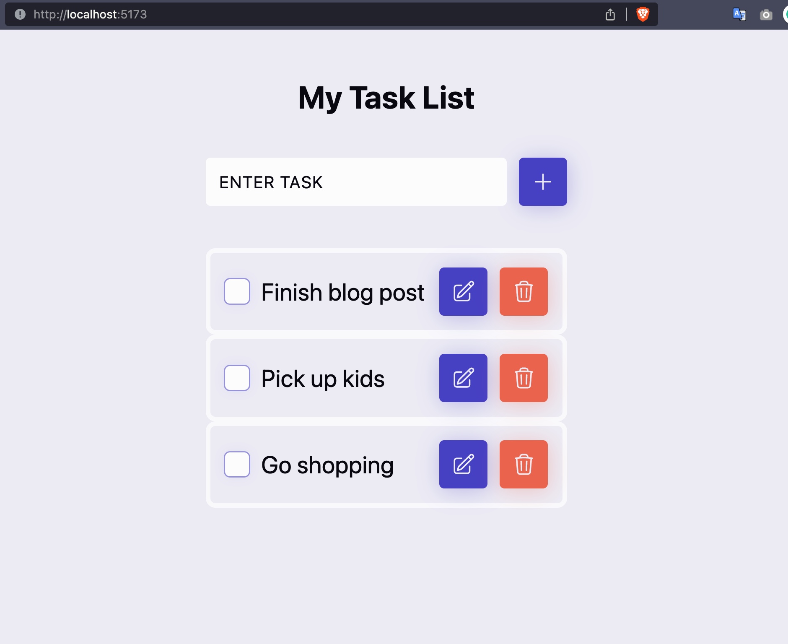
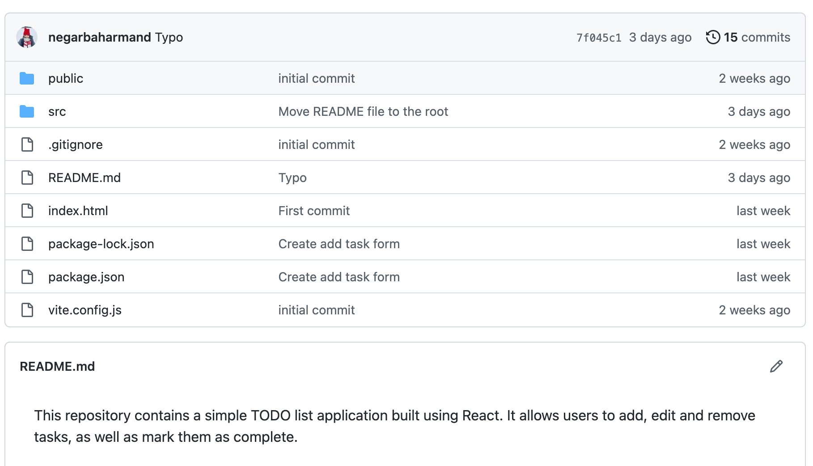

My ToDo list project is a simple todo list that is built using React. Building this project helped me learn the basics of building React applications such as making components, using different React hooks like `useState` and `useEffect` and how to store data as key-value pairs inside a browser using `localStorage`.

The ToDo React application empowers users to:

- Create new task lists
- Delete and edit tasks through corresponding icons
- Mark tasks as done by toggling the checkbox
  For those eager to explore and try the ToDo-React project, the code is available on [project's github page](https://github.com/negarbaharmand/ToDo-React).
  
